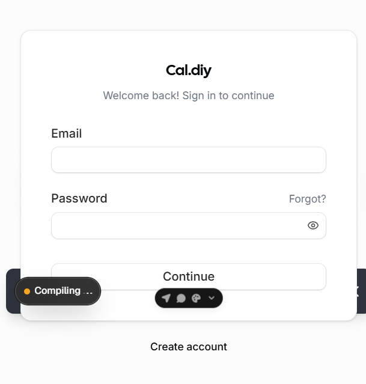
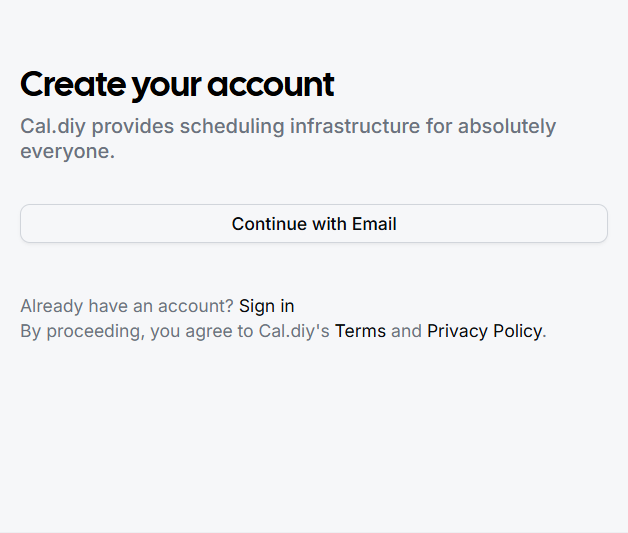
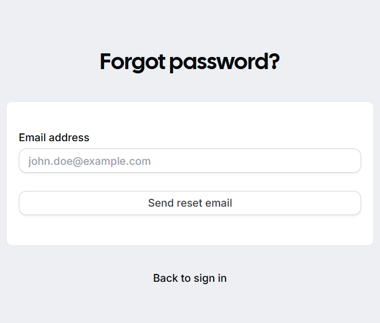

# Cal.diy Administration and End-User Guide

This guide is a practical runbook for:

- Setting up and administering your self-hosted Cal.diy instance
- Creating the first administrator account
- Understanding what end users will experience

It is written as a pre-deployment guide before Linux-2 container rollout.

## Scope and assumptions

- You are deploying Cal.diy in self-hosted mode.
- You will run the application with Docker Compose on Linux.
- You have access to environment values and secrets already prepared for your environment.

Reference implementation details in the main project docs:

- README first-user setup: ../../README.md
- Docker Compose run guide: ../../README.md

## Screenshots

## Login page



## Sign-up page



## Forgot-password page



## Administrator guide

## 1) Day-0 checklist for admin

Before first launch, confirm:

- NEXT_PUBLIC_WEBAPP_URL is set to your final URL
- NEXTAUTH_URL aligns with your web app URL and auth path
- NEXTAUTH_SECRET is generated securely
- CALENDSO_ENCRYPTION_KEY is generated securely
- DATABASE_URL points to a reachable Postgres instance
- SMTP/mail provider is configured if you want password-reset and notifications

Recommended key generation (from project guidance):

```bash
openssl rand -base64 32   # NEXTAUTH_SECRET
openssl rand -base64 24   # CALENDSO_ENCRYPTION_KEY
```

## 2) Start the stack (Linux target pattern)

Use the standard Docker Compose flow:

```bash
docker compose pull
docker compose up -d
```

For remote DB mode, run only required services:

```bash
docker compose up -d calcom studio
```

## 3) Create the first admin account

There are two supported approaches.

### Approach A (recommended): setup wizard in browser

1. Open your Cal.diy URL.
2. Complete the first-run setup wizard.
3. Define the first user.
4. Finish onboarding and access Event Types dashboard.

Notes:

- The first user should be treated as the initial administrator/owner account.
- If calendar connection is not desired at setup time, you can skip to Event Types and add integrations later.

### Approach B (fallback): direct creation in Prisma Studio

Use this when setup wizard is unavailable or blocked.

1. Open Prisma Studio.
2. Add a User record.
3. Set email, username, and bcrypt-hashed password.
4. Set metadata to {}.
5. Save and sign in via the login page.

## 4) Post-creation hardening tasks

Immediately after first login:

1. Verify admin can access settings and event management.
2. Set production-safe SMTP so password reset works.
3. Enforce strong password policy internally.
4. Add at least one backup admin account.
5. Validate timezone and locale defaults.
6. Confirm branding and public booking URL behavior.
7. Capture and store backup/restore procedure for database.

## 5) Ongoing admin responsibilities

Daily/weekly:

- Monitor service health and container restart behavior
- Check app logs for auth/session errors
- Review failed email delivery events
- Validate booking creation and cancellation flows

Release/update:

1. Pull new images.
2. Run compose update in maintenance window.
3. Verify login and booking flows after update.
4. Roll back quickly if auth or booking regression appears.

## End-user experience guide

## What users see first

1. User lands on login page or sign-up page.
2. New users can register and then sign in.
3. Existing users sign in and reach their scheduling workspace.

## Core end-user journey

1. Create or edit event types.
2. Share booking link.
3. Invitees choose time slots and book.
4. User receives booking updates and can manage schedule.

## Password recovery journey

1. User opens Forgot password page.
2. User enters email.
3. User receives reset email (requires SMTP configured).
4. User resets password and signs back in.

## Common support scenarios

1. "I did not receive reset email"
- Check SMTP credentials, sender domain, and spam filtering.

2. "I can sign in but cannot book"
- Check event type availability, timezone, and calendar connection state.

3. "Invitees cannot access my booking page"
- Check public URL, reverse proxy, TLS cert, and DNS.

## Operational acceptance checks before Linux-2 deployment

Use this quick test list in staging:

1. Login page loads within expected latency.
2. Sign-up flow is reachable and functional.
3. Forgot-password flow sends mail successfully.
4. First admin account can create and publish an event type.
5. A test invitee can complete a booking end-to-end.
6. Cancellation and reschedule links function correctly.

## Inputs needed from you for the next phase (Linux-2 deployment)

If you want me to continue directly into deployment steps after this guide, please confirm:

1. Linux-2 host access method (SSH or agent-executed commands).
2. Final domain name and TLS strategy (reverse proxy or direct).
3. SMTP provider details and sender domain.
4. Whether to use bundled Postgres container or external managed Postgres.
5. Preferred backup target for DB snapshots.

Once confirmed, I can produce a deployment runbook tailored to your Linux-2 environment and secrets setup.
